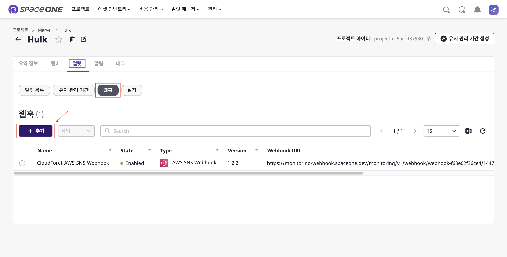
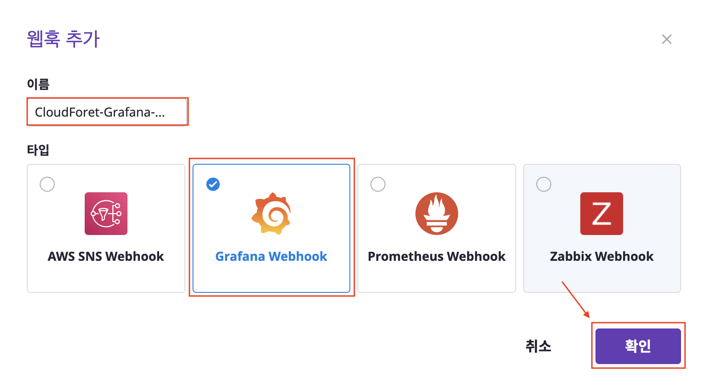
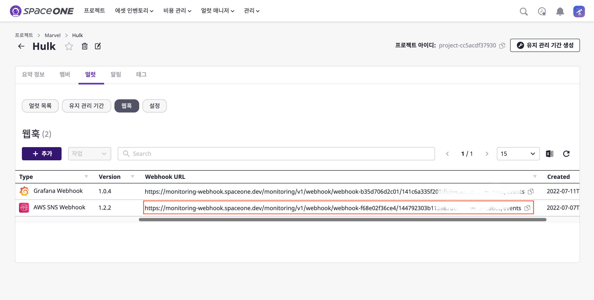
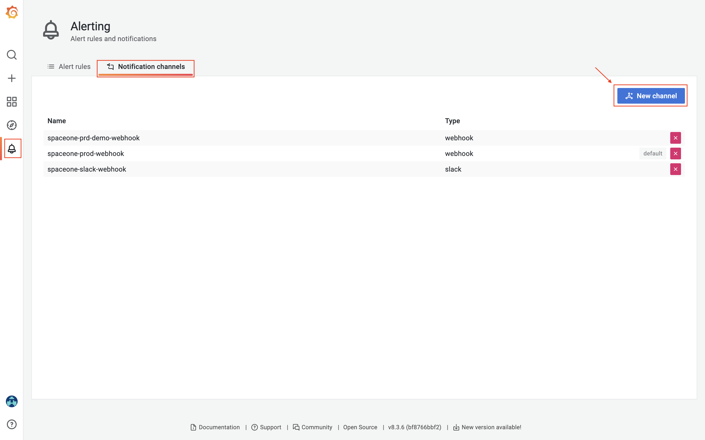
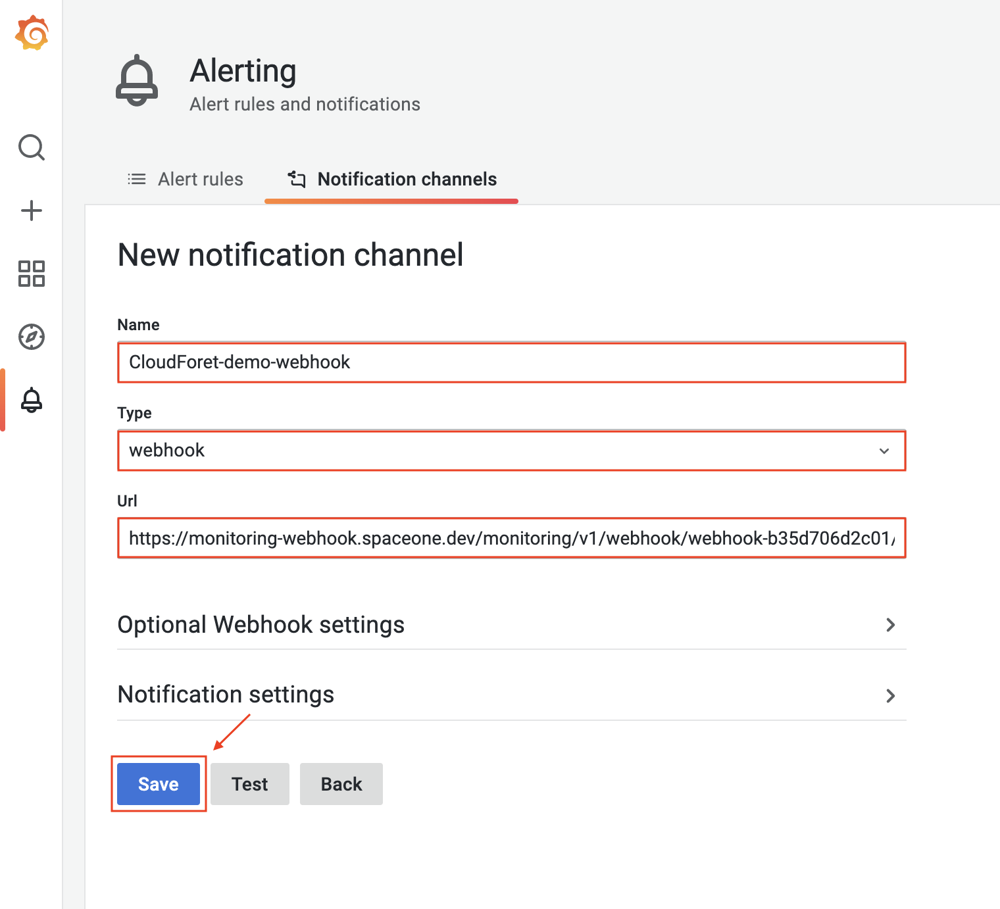
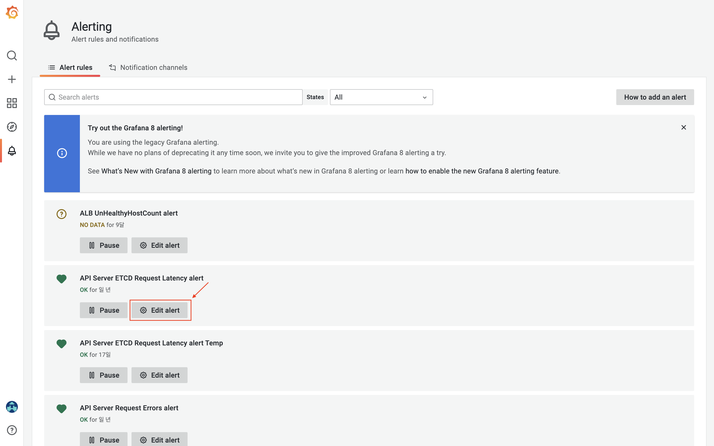
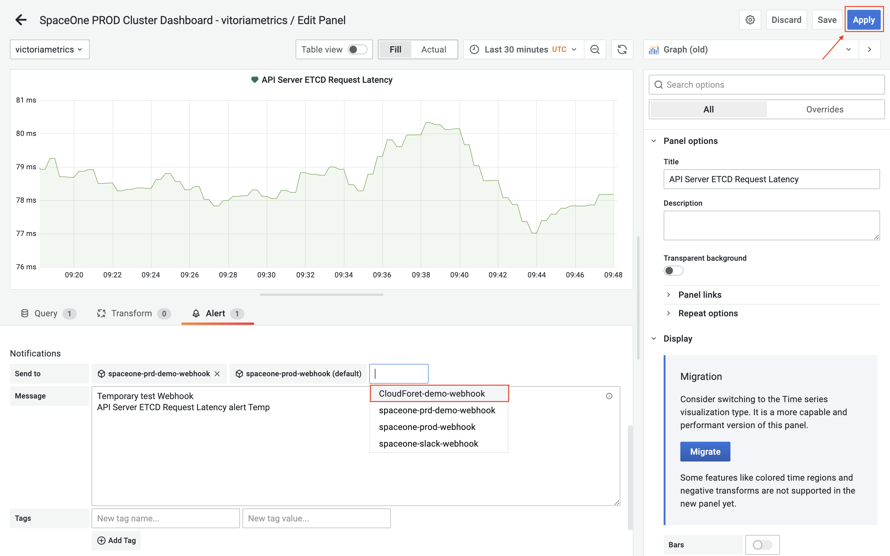

## 개요

클라우드포레는 Grafana와 연동하기 위해 Grafana Webhook을 제공하고 있습니다.  
본 가이드는 Grafana 에서 보내는 Alert 을 클라우드포레로 수신하기 위한 설정 방법을 안내 합니다. 설정 방법은 아래와 같은 순서로 수행합니다.

[1. Grafana Webhook 생성](./GUIDE.md/#1-grafana-webhook-생성)  
[2. Notification channels 설정](./GUIDE.md/#2-notification-channels-설정)  
[3. Alert rules에 webhook 추가](./GUIDE.md/#3-alert-rules에-notification-channel-추가)  

Grafana는 타 서비스와 연동하기 위해 Notification channels 이라는 기능을 제공하며,   
이 channel 에 클라우드포레의 Webhook URL 을 명세하여 Grafana 에서 발생하는 Alert을 클라우드포레로 전송 가능합니다.

 
 

## 1. Grafana Webhook 생성

클라우드포레에서 Grafana Webhook을 생성하면 Webhook URL을 획득할 수 있습니다.

다음 단계를 통해 알아보도록 하겠습니다.

(1) 클라우드포레의 특정 프로젝트에서 [얼럿]을 클릭 합니다.  
&nbsp;&nbsp;&nbsp;&nbsp;&nbsp;[웹훅] 버튼을 클릭하면 현재 생성된 웹훅 목록을 볼 수 있습니다.  
&nbsp;&nbsp;&nbsp;&nbsp;&nbsp;[ + 추가] 버튼을 클릭하여 새로운 Grafana Webhook을 생성합니다.

(2) 모달이 열리면 [이름]을 기입하고 [Grafana Webhook]을 선택 후 [확인] 버튼을 클릭 합니다.

(3) 생성된 Grafana Webhook을 확인할 수 있습니다.  
&nbsp;&nbsp;&nbsp;&nbsp;&nbsp;`Webhook URL`은 Grafana와 연동을 위해 사용됩니다.

 
 

## 2. Notification channels 설정

이제 Grafana에서 Notification channels을 설정 하겠습니다.  
여기서는 이전 단계에서 생성한 Webhook 의 URL 이 사용될 예정입니다.

(1) Grafana 콘솔 로그인 > [Alerting] > [Notification channels] > [New channel] 버튼을 클릭 합니다.

(2) 사용할 [Name]을 기입합니다.  
&nbsp;&nbsp;&nbsp;&nbsp;&nbsp;[Type]은 `webhook`, [Url]은 [1. Grafana Webhook 생성](./GUIDE.md/#1-grafana-webhook-생성)에서 획득한 Webhook URL을 입력 합니다.  
&nbsp;&nbsp;&nbsp;&nbsp;&nbsp;[Save] 버튼을 클릭해 Notification channel을 생성 합니다.

 
 

## 3. Alert rules에 Notification channel 추가

실제 rules에 생성한 Notification channel을 추가해 보겠습니다.  
사용자 환경에 맞게 사용하고 있는 rule에 생성한 Notification channel을 추가하면 됩니다.

아래는 예시로 1개의 특정 rule에 Notification channel을 추가해보도록 하겠습니다.

(1) 추가할 rule의 [Edit alert] 버튼을 클릭 합니다.

(2) [Notifications] 항목의 [Send to]에 생성한 channel인 `CloudForet-demo-webhook`을 추가 합니다.

이제, 모든 설정은 끝났습니다. **클라우드포레에서 Grafana의 Alert을 수신할 수 있습니다.**